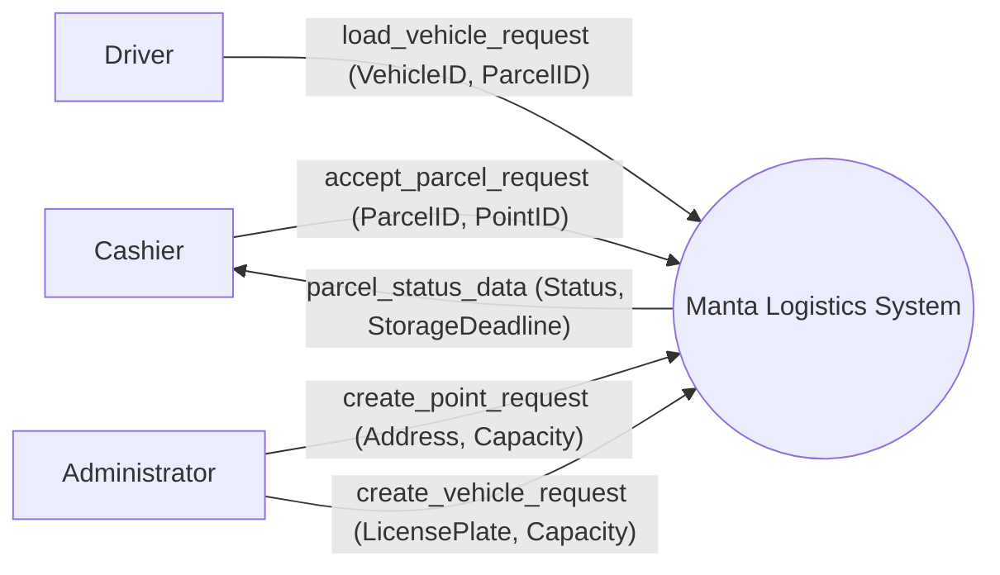

```mermaid
graph LR
    Cashier[Cashier]
    Driver[Driver]
    Admin[Administrator]

    Manta((Manta Logistics System))

    Cashier -- "accept_parcel_request (ParcelID, PointID)" --> Manta
    Manta -- "parcel_status_data (Status, StorageDeadline)" --> Cashier

    Driver -- "load_vehicle_request (VehicleID, ParcelID)" --> Manta

    Admin -- "create_point_request (Address, Capacity)" --> Manta
    Admin -- "create_vehicle_request (LicensePlate, Capacity)" --> Manta
```