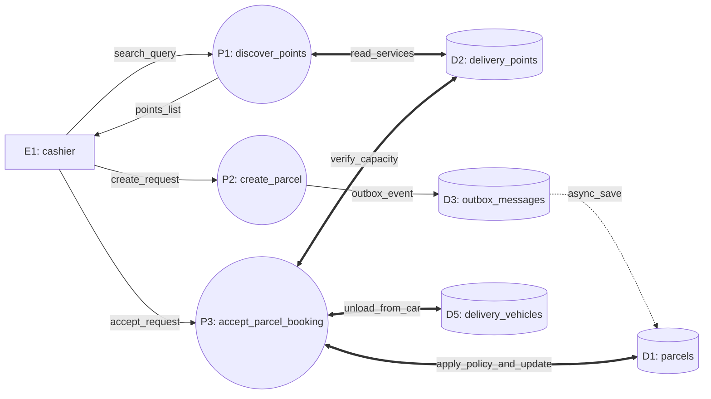

```mermaid
flowchart LR
    E1[E1: cashier]:::entity

    D1[(D1: parcels)]:::store
    D2[(D2: delivery_points)]:::store
    D3[(D3: outbox_messages)]:::store
    D5[(D5: delivery_vehicles)]:::store

    P1((P1: discover_points)):::process
    P2((P2: create_parcel)):::process
    P3((P3: accept_parcel_booking)):::process

    E1 -- search_query --> P1
    P1 <== read_services ==> D2
    P1 -- points_list --> E1

    E1 -- create_request --> P2
    P2 -- outbox_event --> D3
    D3 -. async_save .-> D1

    E1 -- accept_request --> P3
    P3 <== verify_capacity ==> D2
    P3 <== unload_from_car ==> D5
    P3 <== apply_policy_and_update ==> D1
```