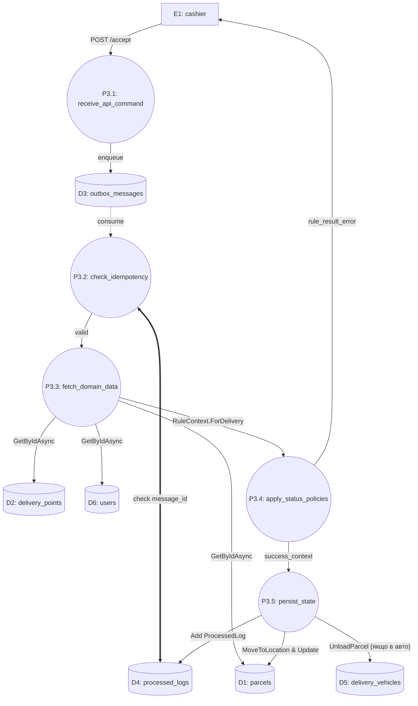

```mermaid
flowchart TD

    E1[E1: cashier]
    D1[(D1: parcels)]:::store
    D2[(D2: delivery_points)]:::store
    D3[(D3: outbox_messages)]:::store
    D4[(D4: processed_logs)]:::store
    D5[(D5: delivery_vehicles)]:::store
    D6[(D6: users)]:::store

    P3_1((P3.1: receive_api_command)):::process
    P3_2((P3.2: check_idempotency)):::process
    P3_3((P3.3: fetch_domain_data)):::process
    P3_4((P3.4: apply_status_policies)):::process
    P3_5((P3.5: persist_state)):::process

    E1 -- "POST /accept" --> P3_1
    P3_1 -- "enqueue" --> D3
    D3 -. "consume" .-> P3_2

    P3_2 <== "check message_id" ==> D4
    P3_2 -- "valid" --> P3_3

    P3_3 -- "GetByIdAsync" --> D1
    P3_3 -- "GetByIdAsync" --> D2
    P3_3 -- "GetByIdAsync" --> D6
    P3_3 -- "RuleContext.ForDelivery" --> P3_4

    P3_4 -- "rule_result_error" --> E1
    P3_4 -- "success_context" --> P3_5

    P3_5 -- "UnloadParcel (якщо в авто)" --> D5
    P3_5 -- "MoveToLocation & Update" --> D1
    P3_5 -- "Add ProcessedLog" --> D4
```