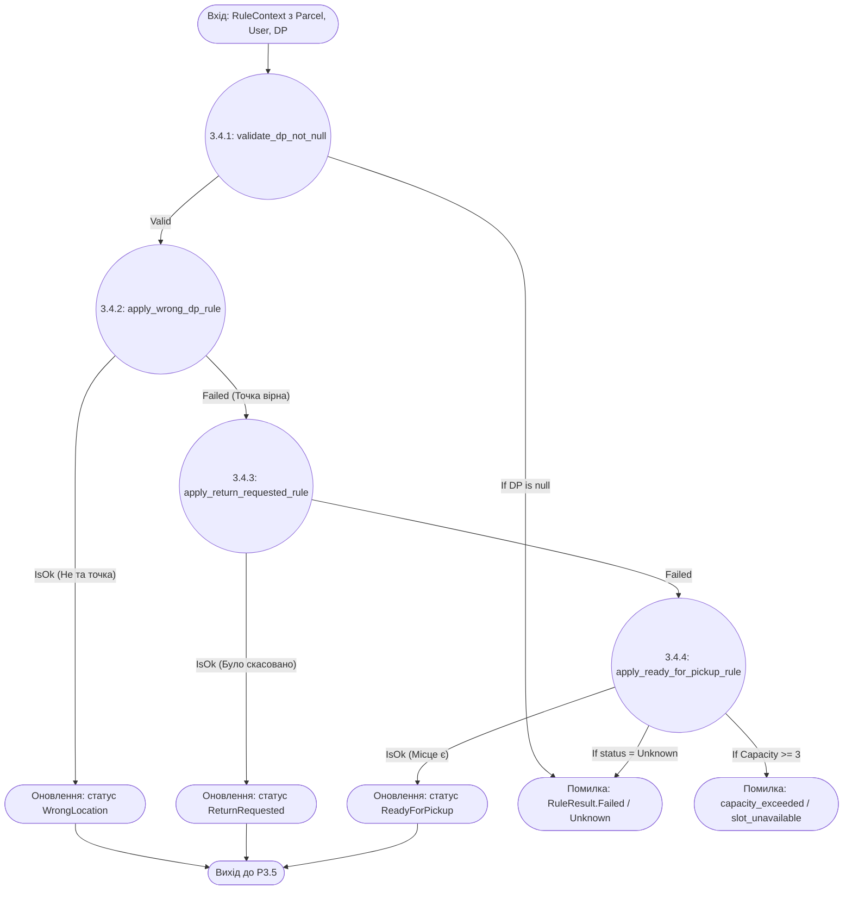

```mermaid
flowchart TD
    Input([Вхід: RuleContext з Parcel, User, DP])

    P3_4_1((3.4.1: validate_dp_not_null)):::process
    P3_4_2((3.4.2: apply_wrong_dp_rule)):::process
    P3_4_3((3.4.3: apply_return_requested_rule)):::process
    P3_4_4((3.4.4: apply_ready_for_pickup_rule)):::process

    StatusWrong([Оновлення: статус WrongLocation]):::state
    StatusReturn([Оновлення: статус ReturnRequested]):::state
    StatusReady([Оновлення: статус ReadyForPickup]):::state

    ErrSystem([Помилка: RuleResult.Failed / Unknown]):::error
    ErrCapacity([Помилка: capacity_exceeded / slot_unavailable]):::error

    Input --> P3_4_1

    P3_4_1 -- "If DP is null" --> ErrSystem
    P3_4_1 -- "Valid" --> P3_4_2

    P3_4_2 -- "IsOk (Не та точка)" --> StatusWrong
    P3_4_2 -- "Failed (Точка вірна)" --> P3_4_3

    P3_4_3 -- "IsOk (Було скасовано)" --> StatusReturn
    P3_4_3 -- "Failed" --> P3_4_4

    P3_4_4 -- "If Capacity >= 3" --> ErrCapacity
    P3_4_4 -- "If status = Unknown" --> ErrSystem
    P3_4_4 -- "IsOk (Місце є)" --> StatusReady

    StatusWrong --> Out([Вихід до P3.5])
    StatusReturn --> Out
    StatusReady --> Out
```