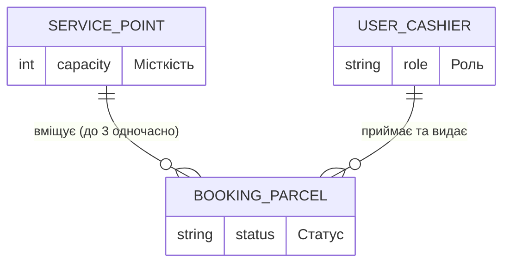

```mermaid
erDiagram
    SERVICE_POINT ||--o{ BOOKING_PARCEL : "вміщує (до 3 одночасно)"
    USER_CASHIER ||--o{ BOOKING_PARCEL : "приймає та видає"
    
    SERVICE_POINT {
        int capacity "Місткість"
    }
    BOOKING_PARCEL {
        string status "Статус"
    }
    USER_CASHIER {
        string role "Роль"
    }
```