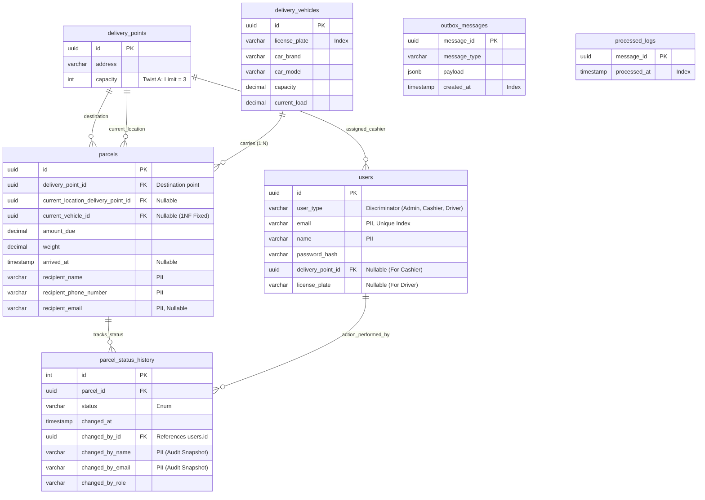

```mermaid
erDiagram
    delivery_points ||--o{ parcels : "destination"
    delivery_points ||--o{ parcels : "current_location"
    delivery_vehicles ||--o{ parcels : "carries (1:N)"
    parcels ||--o{ parcel_status_history : "tracks_status"
    users ||--o{ parcel_status_history : "action_performed_by"
    delivery_points ||--o{ users : "assigned_cashier"

    parcels {
        uuid id PK
        uuid delivery_point_id FK "Destination point"
        uuid current_location_delivery_point_id FK "Nullable"
        uuid current_vehicle_id FK "Nullable (1NF Fixed)"
        decimal amount_due
        decimal weight
        timestamp arrived_at "Nullable"
        varchar recipient_name "PII"
        varchar recipient_phone_number "PII"
        varchar recipient_email "PII, Nullable"
    }

    parcel_status_history {
        int id PK
        uuid parcel_id FK
        varchar status "Enum"
        timestamp changed_at
        uuid changed_by_id FK "References users.id"
        varchar changed_by_name "PII (Audit Snapshot)"
        varchar changed_by_email "PII (Audit Snapshot)"
        varchar changed_by_role
    }

    delivery_points {
        uuid id PK
        varchar address
        int capacity "Twist A: Limit = 3"
    }

    delivery_vehicles {
        uuid id PK
        varchar license_plate "Index"
        varchar car_brand
        varchar car_model
        decimal capacity
        decimal current_load
    }

    users {
        uuid id PK
        varchar user_type "Discriminator (Admin, Cashier, Driver)"
        varchar email "PII, Unique Index"
        varchar name "PII"
        varchar password_hash
        uuid delivery_point_id FK "Nullable (For Cashier)"
        varchar license_plate "Nullable (For Driver)"
    }

    outbox_messages {
        uuid message_id PK
        varchar message_type
        jsonb payload
        timestamp created_at "Index"
    }

    processed_logs {
        uuid message_id PK
        timestamp processed_at "Index"
    }
```