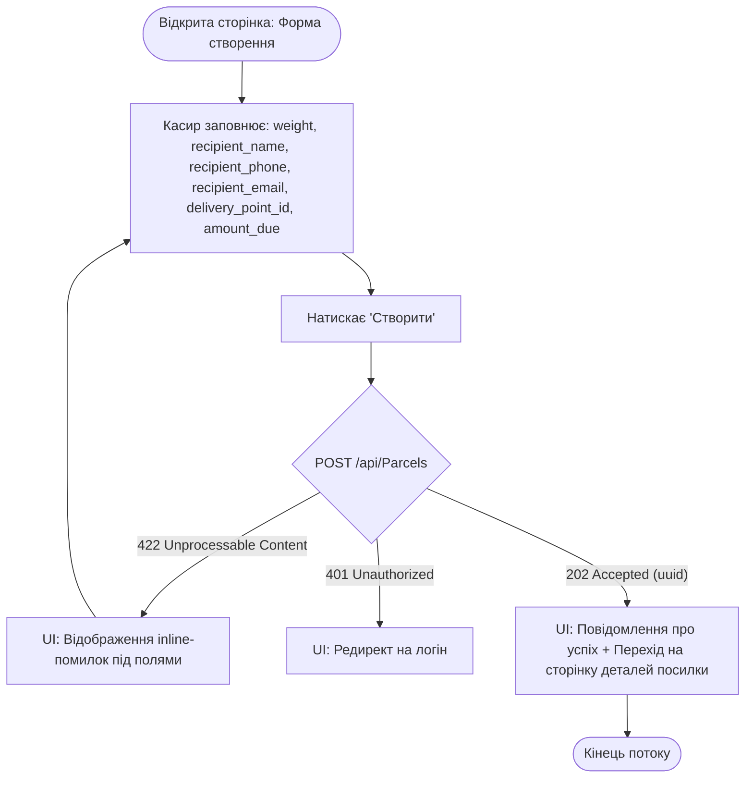

```mermaid
flowchart TD
    Start([Відкрита сторінка: Форма створення]) --> FillForm[Касир заповнює: weight, recipient_name, recipient_phone, recipient_email, delivery_point_id, amount_due]
    FillForm --> Submit[Натискає 'Створити']
    
    Submit --> API{"POST /api/Parcels"}
    
    API -- "422 Unprocessable Content" --> ValError[UI: Відображення inline-помилок під полями]
    ValError --> FillForm
    
    API -- "401 Unauthorized" --> AuthError[UI: Редирект на логін]
    
    API -- "202 Accepted (uuid)" --> Success[UI: Повідомлення про успіх + Перехід на сторінку деталей посилки]
    Success --> End([Кінець потоку])
```