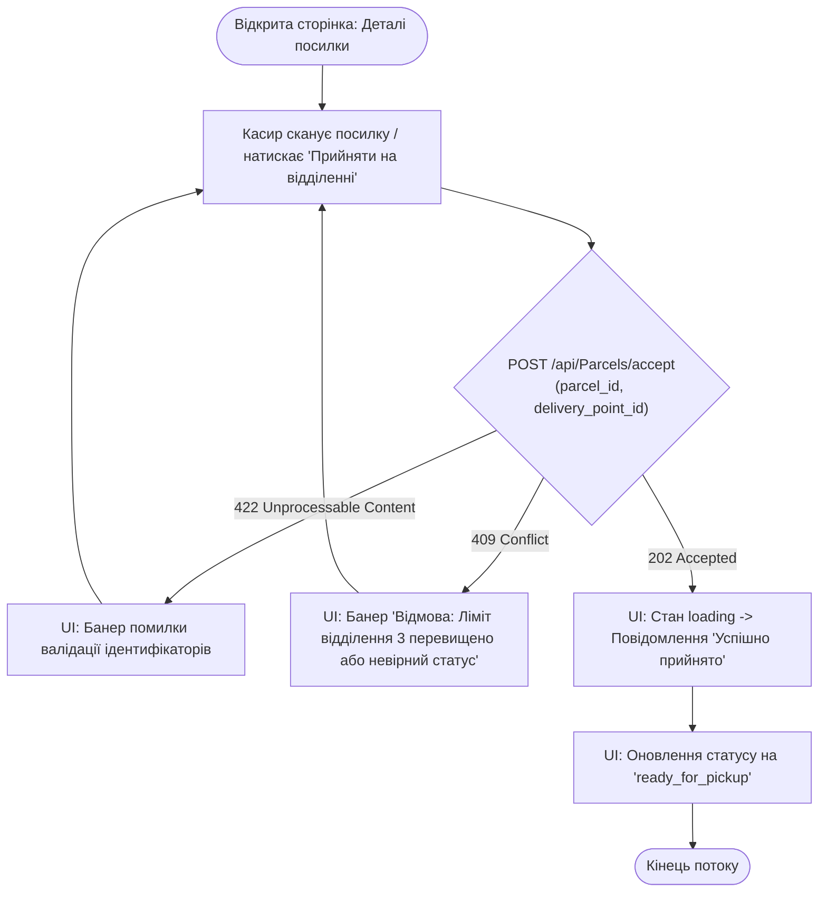

```mermaid
flowchart TD
    Start([Відкрита сторінка: Деталі посилки]) --> Action[Касир сканує посилку / натискає 'Прийняти на відділенні']
    
    Action --> API{"POST /api/Parcels/accept\n(parcel_id, delivery_point_id)"}
    
    API -- "422 Unprocessable Content" --> ErrFormat[UI: Банер помилки валідації ідентифікаторів]
    ErrFormat --> Action
    
    API -- "409 Conflict" --> ErrCapacity[UI: Банер 'Відмова: Ліміт відділення 3 перевищено або невірний статус']
    ErrCapacity --> Action
    
    API -- "202 Accepted" --> Success[UI: Стан loading -> Повідомлення 'Успішно прийнято']
    Success --> UpdateUI[UI: Оновлення статусу на 'ready_for_pickup']
    UpdateUI --> End([Кінець потоку])
```