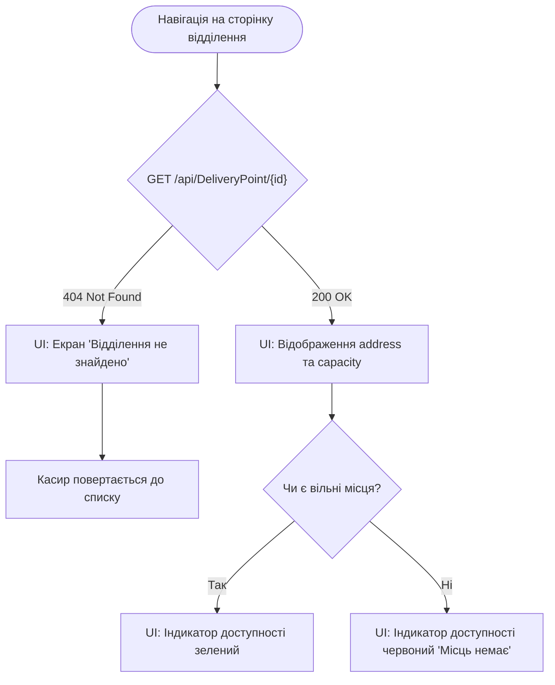

```mermaid
flowchart TD
    Start([Навігація на сторінку відділення]) --> API{"GET /api/DeliveryPoint/{id}"}
    
    API -- "404 Not Found" --> ErrNotFound[UI: Екран 'Відділення не знайдено']
    ErrNotFound --> GoBack[Касир повертається до списку]
    
    API -- "200 OK" --> Render[UI: Відображення address та capacity]
    Render --> CheckCapacity{Чи є вільні місця?}
    
    CheckCapacity -- "Так" --> ShowAvailable[UI: Індикатор доступності зелений]
    CheckCapacity -- "Ні" --> ShowFull[UI: Індикатор доступності червоний 'Місць немає']
```